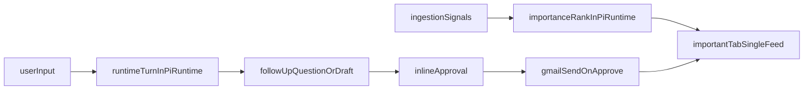

# Canonical Important-First Runtime Plan

## Product Contract (from your direction)

- One primary surface: `Important` list for today’s important work (reminders,
  todos, emails needing response).
- Command input is free-form natural language; no regex intent gating decides
  behavior.
- For email tasks, flow is conversational: user asks -> assistant asks follow-up
  if needed -> assistant drafts -> user approves -> system sends.
- No command-generated Todo indirection; command runs are inline-only (not added
  to a separate Todo tab/list).

## Current Gaps to Close

- UI is split into `Inbox` and `Todo List` in
  [apps/web/src/app/(protected)/\_components/command-center.tsx](<apps/web/src/app/(protected)/_components/command-center.tsx>).
- Command pipeline relies on regex/heuristic routing in
  [apps/web/src/app/(protected)/\_components/command-input.tsx](<apps/web/src/app/(protected)/_components/command-input.tsx>)
  and [apps/web/convex/lib/agent.ts](apps/web/convex/lib/agent.ts).
- Email approval path is draft-first/stubbed, not canonical send-on-approval, in
  [apps/web/convex/actions.ts](apps/web/convex/actions.ts) and
  [packages/pi-runtime/src/extensions/gmail.ts](packages/pi-runtime/src/extensions/gmail.ts).
- pi-runtime still uses gateway assumptions in
  [packages/pi-runtime/src/classify-importance.ts](packages/pi-runtime/src/classify-importance.ts).

## Implementation Plan

### 1) Canonical workflow contracts first

- Define canonical run states for command sessions and important items in:
  - [packages/domain/src/runtime.ts](packages/domain/src/runtime.ts)
  - [apps/web/convex/schema.ts](apps/web/convex/schema.ts)
- Add explicit state for inline follow-up turns (for example: awaiting follow-up
  vs awaiting approval) so prompting is first-class, not implied by ad-hoc
  fields.
- Keep command runs as inline interaction records; do not convert command runs
  into Todo-list entities.

### 2) Make pi-runtime the single LLM decision engine

- Move command intent interpretation, follow-up generation, and proposal
  drafting ownership into `packages/pi-runtime` (new runtime command module +
  exports via
  [packages/pi-runtime/src/index.ts](packages/pi-runtime/src/index.ts)).
- De-emphasize/remove regex intent routing ownership from
  [apps/web/convex/lib/agent.ts](apps/web/convex/lib/agent.ts); Convex should
  orchestrate persistence, auth, and retrieval only.
- Keep ingestion importance scoring in pi-runtime, including the borderline
  adjudication path currently split with Convex in
  [apps/web/convex/ingestion.ts](apps/web/convex/ingestion.ts).

### 3) Direct OpenCode Zen, strict-fail config

- Replace gateway transport in
  [packages/pi-runtime/src/classify-importance.ts](packages/pi-runtime/src/classify-importance.ts)
  with direct OpenCode Zen calls.
- Use Convex runtime env only:
  - `OPENCODE_API_KEY` (required)
  - `PI_RUNTIME_MODEL` (required, no default)
- Keep strict-fail behavior (missing key/model or invalid response fails action;
  no silent fallback).
- Remove stale gateway assumptions from `turbo`/docs where no longer needed.

### 4) Canonical input UX: no regex-driven behavior

- Rework
  [apps/web/src/app/(protected)/\_components/command-input.tsx](<apps/web/src/app/(protected)/_components/command-input.tsx>):
  - remove slash-command dependence as behavior driver
  - remove mention/email validity gating as a precondition for processing
  - always submit raw user text to runtime turn API
- Keep optional UI conveniences (contact suggestions/autocomplete) only as
  non-blocking enhancements, never as routing logic.
- Ensure strings like `daniel@gmail.con` are treated as normal text and
  interpreted by LLM + follow-up logic.

### 5) Inline-only command conversation flow

- Update [apps/web/convex/agent.ts](apps/web/convex/agent.ts) to support
  multi-turn inline command runs:
  - `preview` (first turn)
  - `respond` (follow-up answer turn)
  - `confirm` (approve final draft/send)
- Do not insert queue/todo items for command runs during clarification/proposal.
- Keep retrieval enrichment from
  [apps/web/convex/retrieval.ts](apps/web/convex/retrieval.ts) as context to
  runtime turn generation.

### 6) Approve means send for email

- Extend extension contracts in
  [packages/pi-runtime/src/contracts.ts](packages/pi-runtime/src/contracts.ts)
  and runtime dispatch in:
  - [packages/pi-runtime/src/registry.ts](packages/pi-runtime/src/registry.ts)
  - [packages/pi-runtime/src/execute-extension.ts](packages/pi-runtime/src/execute-extension.ts)
- Add canonical Gmail send extension path in
  [packages/pi-runtime/src/extensions/gmail.ts](packages/pi-runtime/src/extensions/gmail.ts)
  and corresponding integration implementation.
- Update [apps/web/convex/actions.ts](apps/web/convex/actions.ts) so approving
  email action executes send semantics and records provider message
  reference/idempotency.

### 7) Important tab unification

- Replace `Inbox` + `Todo List` split in
  [apps/web/src/app/(protected)/\_components/command-center.tsx](<apps/web/src/app/(protected)/_components/command-center.tsx>)
  with one `Important` tab.
- Retire command-run-driven Todo list UI in
  [apps/web/src/app/(protected)/\_components/todo-list.tsx](<apps/web/src/app/(protected)/_components/todo-list.tsx>)
  from main workflow.
- Keep
  [apps/web/src/app/(protected)/\_components/notification-feed.tsx](<apps/web/src/app/(protected)/_components/notification-feed.tsx>)
  as the primary important feed and align labels/copy to “today’s important
  items”.

### 8) Validation and regression safety

- Add pi-runtime tests for:
  - turn interpretation + follow-up branching
  - strict JSON/schema parsing of LLM outputs
  - strict-fail env handling
- Add Convex integration tests for:
  - inline command conversation lifecycle
  - email approve -> send execution
  - important feed staying coherent after actions
- Update docs:
  - [README.md](README.md)
  - [docs/convex-migration-plan.md](docs/convex-migration-plan.md)

## Risks and Mitigations

- LLM output instability: enforce schema validation and typed coercion
  boundaries in pi-runtime.
- UX regressions during transition: keep old heuristics behind a temporary
  internal fallback flag until parity is verified.
- Email send safety: keep idempotency keys and explicit approval gate in
  [apps/web/convex/actions.ts](apps/web/convex/actions.ts) so “approve” is the
  only send trigger.
