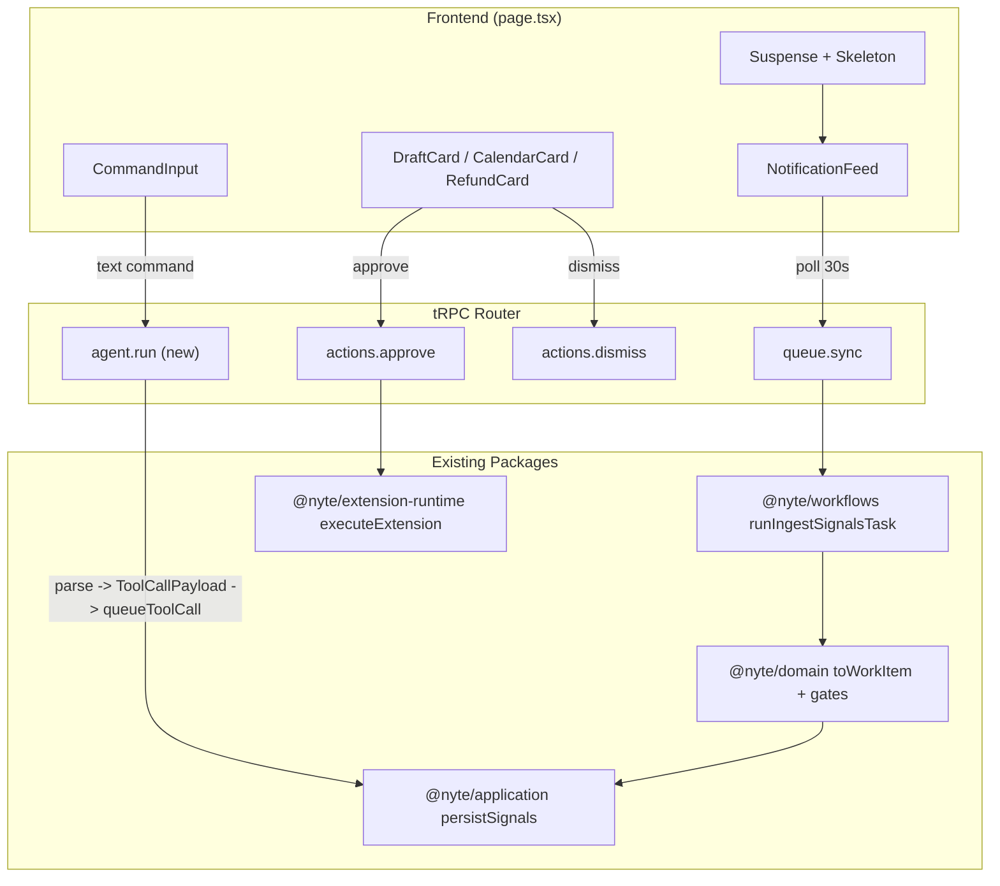
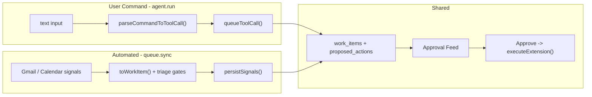

# Proactive Assistant Feed MVP

## What Already Exists

The entire backend pipeline is built. Here is the exact data flow with code
references:

### Ingestion -> Triage -> Persistence

1. **tRPC entry**: `queue.sync` fetches Google OAuth token, calls
   `runIngestSignalsTask()`

```95:110:apps/web/src/lib/server/router.ts
    sync: authedProcedure
      .input(
        z.object({
          cursor: z.string().optional(),
          watchKeywords: watchKeywordsSchema.optional(),
        })
      )
      .query(async ({ input, ctx }) => {
        const accessToken = resolveAccessToken(
          await auth.api.getAccessToken({
            headers: ctx.request.headers,
            body: { providerId: GOOGLE_AUTH_PROVIDER },
          })
        );
        // ...
        return runIngestSignalsTask({ userId: ctx.userId, accessToken, ... });
```

1. **Triage**: Each `IntakeSignal` is scored through 5 gates. Only signals
   with >= 1 matched gate become `WorkItem`s:

```175:199:packages/domain/src/triage.ts
export function toWorkItem(
  signal: IntakeSignal,
  now = new Date()
): WorkItem | null {
  const evaluations = evaluateApprovalGates(signal, now);
  const matched = evaluations.filter((evaluation) => evaluation.matched);
  if (matched.length === 0) { return null; }
  // ...priorityScore, type, actions...
  return { id, type, source, actor, summary, context, preview, ... };
}
```

1. **Dashboard query** returns `WorkItemWithAction[]` -- the exact shape the
   feed renders:

```34:36:packages/domain/src/actions.ts
export type WorkItemWithAction = WorkItem & {
  proposedAction: ToolCallPayload;
};
```

Each `WorkItemWithAction` has: `id`, `type` (draft/calendar/refund), `source`
(Gmail/Google Calendar), `actor`, `summary`, `context`, `preview`,
`actionLabel`, `secondaryLabel`, `cta`, `gates`, `priorityScore`,
`proposedAction`.

### Approve / Dismiss via Extension Runtime

1. **Approve** dispatches to pi-runtime via
   `dispatchApprovedActionToExtension()`:

```18:47:packages/workflows/src/extension-dispatch.ts
export async function dispatchApprovedActionToExtension({
  approvedItem, userId = null,
}: ExtensionDispatchInput): Promise<ExtensionResult | null> {
  // ...builds ExtensionExecutionContext...
  if (approvedItem.payload.kind === "gmail.createDraft") {
    return executeExtension({ ...extensionContext,
      name: EXTENSION_NAMES.gmailSaveDraft, input: approvedItem.payload });
  }
  // ...calendar, etc.
}
```

1. **Pi-runtime** routes through typed registry -> handler:

```20:25:packages/pi-runtime/src/registry.ts
export const extensionRegistry: ExtensionRegistry = {
  [EXTENSION_NAMES.gmailReadThreadContext]: gmailReadThreadContext,
  [EXTENSION_NAMES.gmailSaveDraft]: gmailSaveDraft,
  [EXTENSION_NAMES.calendarCreateEvent]: calendarCreateEvent,
  [EXTENSION_NAMES.calendarUpdateEvent]: calendarUpdateEvent,
};
```

### Auth

Google OAuth with Gmail + Calendar scopes already configured in
[auth.ts](apps/web/src/lib/auth.ts). tRPC client wired with React Query in
[trpc.ts](apps/web/src/lib/trpc.ts).

---

## Architecture



No AI SDK. Pi-runtime IS the execution layer. The agent routing is a thin intent
parser -> extension request builder.

---

## tRPC v11 + TanStack React Query v5 Usage

The existing client setup in [trpc.ts](apps/web/src/lib/trpc.ts) and
[providers.tsx](apps/web/src/components/providers.tsx) is already correct:

```typescript
// trpc.ts
export const { TRPCProvider, useTRPC, useTRPCClient } =
  createTRPCContext<AppRouter>();
```

```typescript
// providers.tsx
<QueryClientProvider client={queryClient}>
  <TRPCProvider trpcClient={trpcClient} queryClient={queryClient}>
    {children}
  </TRPCProvider>
</QueryClientProvider>
```

**The critical pattern**: `useTRPC()` returns a proxy that creates
`queryOptions()` / `mutationOptions()` / `queryKey()` factories. These are NOT
hooks. You pass them into standard TanStack React Query hooks:

```tsx
import { useQuery, useMutation, useQueryClient } from "@tanstack/react-query";
import { useTRPC } from "~/lib/trpc";

function MyComponent() {
  const trpc = useTRPC();
  const queryClient = useQueryClient();

  // Queries: trpc.path.queryOptions(input, tanstackOptions)
  const syncQuery = useQuery(
    trpc.queue.sync.queryOptions(


    )
  );

  // Mutations: trpc.path.mutationOptions({ onSuccess, onMutate, ... })
  const approveMutation = useMutation(
    trpc.actions.approve.mutationOptions({
      onSuccess: () => {
        queryClient.invalidateQueries({
          queryKey: trpc.queue.sync.queryKey(),
        });
      },
    })
  );

  // Query keys for cache manipulation
  const syncQueryKey = trpc.queue.sync.queryKey();
  queryClient.setQueryData(syncQueryKey, (old) => /* optimistic update */);
}
```

**This is NOT the old tRPC v10 proxy pattern** (`trpc.queue.sync.useQuery(...)`
does not exist in v11).

---

## Zod v4 Alignment

Codebase uses `zod@^4.3.6`. The root `"zod"` export is Zod 4 since 4.0.0.
Current imports from `"zod"` are correct.

**However**, [router.ts](apps/web/src/lib/server/router.ts) uses Zod 3-style
chained validators that should use v4 top-level APIs:

```typescript
// Current (v3-style, still works but not idiomatic v4):
z.string().email();
z.string().datetime({ offset: true });

// Zod v4 top-level APIs:
z.email();
z.iso.datetime({ offset: true });
```

[env.ts](apps/web/src/lib/server/env.ts) already uses `z.url()` (v4 top-level)
-- good.

**Action**: Migrate `toolCallPayloadSchema` in router.ts to use `z.email()` and
`z.iso.datetime()`. All new Zod schemas in `agent.run` should use v4 top-level
APIs from the start.

---

## Vercel React Best Practices Applied

### CRITICAL: Eliminating Waterfalls

`**async-suspense-boundaries`: The feed page should use a Suspense boundary so
the shell (sidebar + input bar) renders immediately while the queue data streams
in.

```tsx
export default function App() {
  return (
    <section className="...">
      <CommandInput />
      <Suspense fallback={<FeedSkeleton />}>
        <NotificationFeed />
      </Suspense>
    </section>
  );
}
```

`**async-parallel**`: The existing `runIngestSignalsTask` already fetches
Gmail + Calendar in parallel via Promise.all -- no change needed.

### CRITICAL: Bundle Size

`**bundle-barrel-imports**`: Already handled -- AGENTS.md mandates
`@nyte/ui/components/*` direct imports, icons from
`@central-icons-react/round-filled-radius-2-stroke-1.5`.

### HIGH: Server-Side Performance

`**server-serialization**`: The feed is client-side (tRPC query), so
serialization boundary is the tRPC response. `WorkItemWithAction` is already
lean -- no fat objects to trim.

`**server-parallel-fetching**`: Layout remains a server component (auth check),
feed is a client component with its own data fetching. No server waterfall.

### MEDIUM: Re-render Optimization

`**rerender-functional-setstate**`: All mutation callbacks (approve, dismiss)
should use functional updates for optimistic state removal:

```tsx
const syncQueryKey = trpc.queue.sync.queryKey();
queryClient.setQueryData(syncQueryKey, (old) =>
  old
    ? {
        ...old,
        approvalQueue: old.approvalQueue.filter((item) => item.id !== itemId),
      }
    : old
);
```

### MEDIUM: Rendering Performance

`**rendering-content-visibility**`: Apply to card list items for faster initial
render when queue grows:

```css
.work-item-card {
  content-visibility: auto;
  contain-intrinsic-size: 0 120px;
}
```

`**rendering-conditional-render**`: Use ternary (`? :`) not `&&` for conditional
rendering to avoid rendering `0` or `NaN`.

### React 19 APIs

`**react19-no-forwardref**`: Use `ref` as a regular prop. Use `use()` instead of
`useContext()` for any context access.

---

## Composition Patterns Applied

### Avoid Boolean Prop Proliferation on Cards

Instead of one `WorkItemCard` with
`if (type === "draft") ... else if (type === "calendar")`, create **explicit
variant components** that share a common `Card.Frame`:

```tsx
const Card = {
  Frame: CardFrame,
  Header: CardHeader,
  Preview: CardPreview,
  Actions: CardActions,
};

function DraftCard({ item }: { item: WorkItemWithAction }) {
  return (
    <Card.Frame>
      <Card.Header
        actor={item.actor}
        source={item.source}
        summary={item.summary}
      />
      <Card.Preview icon={GmailIcon} label="Draft">
        {item.preview}
      </Card.Preview>
      <Card.Actions
        primary={{ label: item.cta, onAction: () => approve(item.id) }}
        secondary={{
          label: item.secondaryLabel,
          onAction: () => dismiss(item.id),
        }}
      />
    </Card.Frame>
  );
}

function CalendarCard({ item }: { item: WorkItemWithAction }) {
  return (
    <Card.Frame>
      <Card.Header
        actor={item.actor}
        source={item.source}
        summary={item.summary}
      />
      <Card.Preview
        icon={CalendarIcon}
        label={formatEventTime(item.proposedAction)}
      >
        {item.preview}
      </Card.Preview>
      <Card.Actions
        primary={{ label: item.cta, onAction: () => approve(item.id) }}
        secondary={{
          label: item.secondaryLabel,
          onAction: () => dismiss(item.id),
        }}
      />
    </Card.Frame>
  );
}
```

Then a simple dispatcher:

```tsx
function WorkItemCard({ item }: { item: WorkItemWithAction }) {
  if (item.type === "calendar") return <CalendarCard item={item} />;
  if (item.type === "refund") return <RefundCard item={item} />;
  return <DraftCard item={item} />;
}
```

Each variant is explicit about what it renders. Shared internals (`Card.Frame`,
`Card.Header`, etc.) are reused without boolean props.

### State Management: Decouple from UI

Mutation state (approve/dismiss callbacks, pending IDs, optimistic removals)
lives in a `FeedProvider` context. Card components consume via `use()`:

```tsx
type FeedContextValue = {
  approve: (itemId: string) => void;
  dismiss: (itemId: string) => void;
  pendingIds: Set<string>;
};

const FeedContext = createContext<FeedContextValue | null>(null);
```

Cards access actions without prop drilling. The provider is the only place that
knows about tRPC mutations, query invalidation, and optimistic updates.

---

## What to Build

### 0. Zod v4 Cleanup in router.ts

Migrate `toolCallPayloadSchema`:

- `z.string().email()` -> `z.email()`
- `z.string().datetime({ offset: true })` -> `z.iso.datetime({ offset: true })`

### 1. Feed Page -- rewrite `page.tsx`

Replace placeholder with client component. Layout: `max-w-[672px] mx-auto`,
Suspense boundary.

```1:7:apps/web/src/app/(protected)/page.tsx
export default function App() {
  return (
    <section className="h-full min-h-0 bg-[var(--color-inset-bg)]">
      <div className="h-10 border-b border-[var(--color-border-subtle)]" />
    </section>
  );
}
```

### 2. Compound Card Components

- `Card.Frame` -- outer container with border, padding, bg
- `Card.Header` -- actor badge + source icon + summary
- `Card.Preview` -- preview text with icon + label
- `Card.Actions` -- primary + secondary action buttons
- `DraftCard`, `CalendarCard`, `RefundCard` -- explicit variants

### 3. NotificationFeed + FeedProvider

Inside the provider, the correct tRPC v11 pattern:

```tsx
const trpc = useTRPC();
const queryClient = useQueryClient();

const syncQuery = useQuery(
  trpc.queue.sync.queryOptions(
    { cursor: undefined },
    { refetchInterval: 30_000 }
  )
);

const approveMutation = useMutation(
  trpc.actions.approve.mutationOptions({
    onMutate: async ({ itemId }) => {
      await queryClient.cancelQueries({ queryKey: trpc.queue.sync.queryKey() });
      const previous = queryClient.getQueryData(trpc.queue.sync.queryKey());
      queryClient.setQueryData(trpc.queue.sync.queryKey(), (old) =>
        old
          ? {
              ...old,
              approvalQueue: old.approvalQueue.filter((i) => i.id !== itemId),
            }
          : old
      );
      return { previous };
    },
    onError: (_err, _vars, context) => {
      if (context?.previous) {
        queryClient.setQueryData(trpc.queue.sync.queryKey(), context.previous);
      }
    },
    onSettled: () => {
      queryClient.invalidateQueries({ queryKey: trpc.queue.sync.queryKey() });
    },
  })
);

const dismissMutation = useMutation(
  trpc.actions.dismiss.mutationOptions({
    // same optimistic pattern as approve
  })
);
```

- `content-visibility: auto` on card items
- `Sonner` toast on action error

### 4. CommandInput Component

- Rounded input + "Go" submit button
- Use `agentRun.isPending` from useMutation for loading state

```tsx
const trpc = useTRPC();
const queryClient = useQueryClient();

const agentRun = useMutation(
  trpc.agent.run.mutationOptions({
    onSuccess: () => {
      queryClient.invalidateQueries({ queryKey: trpc.queue.sync.queryKey() });
    },
  })
);
```

- On success, invalidates `queue.sync` query so new work items appear in feed

### 5. Agent Procedure -- `agent.run` tRPC mutation

New procedure in [router.ts](apps/web/src/lib/server/router.ts).

**All agent commands go through approval.** `agent.run` never calls
`executeExtension()` directly. It parses text into a `ToolCallPayload`, creates
a work item directly in the approval queue (bypassing triage gates), and the
user approves or dismisses.

**Two paths to the approval queue:**



- **Agent path** bypasses triage -- user-initiated commands always surface
- **Ingestion path** applies gate filtering -- only high-priority automated
  signals surface
- Both create the same `work_items` + `proposed_actions` rows, both execute via
  pi-runtime on approve
- `persistSignals()` stays available for future automation that should go
  through triage

`**queueToolCall()` -- new function in `@nyte/application`, sits alongside
`persistSignals()`:

```typescript
async function queueToolCall(
  payload: ToolCallPayload,
  userId: string,
  summary: string,
  now = new Date()
): Promise<string> {
  const itemId = `agent:${now.getTime()}:${randomUUID()}`;
  const actionId = createProposedActionId(itemId);

  await db.transaction(async (tx) => {
    await tx.insert(workItems).values({
      id: itemId,
      userId,
      source: "Agent",
      actor: userId,
      summary,
      context: "",
      preview: JSON.stringify(payload),
      status: "awaiting_approval",
      priorityScore: 10,
      createdAt: now,
      updatedAt: now,
    });
    await tx.insert(proposedActions).values({
      id: actionId,
      workItemId: itemId,
      actionType: payload.kind,
      status: "pending",
      payloadJson: JSON.stringify(payload),
      createdAt: now,
      updatedAt: now,
    });
  });

  return itemId;
}
```

`**parseCommandToToolCall()**` -- keyword matching (MVP):

```typescript
function parseCommandToToolCall(message: string): ToolCallPayload["kind"] {
  const lower = message.toLowerCase();
  if (/\b(schedule|meeting|event|invite|calendar)\b/.test(lower))
    return "google-calendar.createEvent";
  if (/\b(refund|credit|reimburse)\b/.test(lower)) return "billing.queueRefund";
  return "gmail.createDraft";
}
```

**tRPC mutation**:

```typescript
agent: router({
  run: authedProcedure
    .input(z.object({ message: z.string().min(1).max(1000) }))
    .mutation(async ({ input, ctx }) => {
      const kind = parseCommandToToolCall(input.message);
      const payload = buildDefaultPayload(kind, input.message);
      const itemId = await queueToolCall(payload, ctx.userId, input.message);
      return { itemId };
    }),
}),
```

The work item appears in the feed. User approves (which runs
`executeExtension()`) or dismisses. `actions.approve` already accepts
`payloadOverride` so the user can edit the tool call payload before executing.

### 6. Fix -- `userId` should be required (not nullable)

`**dispatchApprovedActionToExtension**` and `**approveActionTask**` currently
allow `userId?: string | null` with a default of `null`. The router always
passes `ctx.userId`, so the types should reflect this requirement.

**Changes**:

```typescript
// packages/workflows/src/extension-dispatch.ts
type ExtensionDispatchInput = {
  approvedItem: ApprovedWorkItem;
  userId: string; // was: userId?: string | null
};

export async function dispatchApprovedActionToExtension({
  approvedItem,
  userId, // no default
}: ExtensionDispatchInput): Promise<ExtensionResult | null> {
  // ... auth: { provider, userId, scopes } ...
}
```

```typescript
// packages/workflows/src/tasks/approve-action-task.ts
export type ApproveActionTaskInput = {
  itemId: ApproveWorkItemParameters[0];
  now?: ApproveWorkItemParameters[1];
  idempotencyKey?: ApproveWorkItemParameters[2];
  payloadOverride?: ApproveWorkItemParameters[3];
  actorUserId: string; // was: actorUserId?: string | null
};

export async function approveActionTask({
  itemId,
  idempotencyKey,
  payloadOverride,
  actorUserId, // no default
  now = new Date(),
}: ApproveActionTaskInput) {
  // ... dispatchApprovedActionToExtension({ approvedItem, userId: actorUserId }) ...
}
```

The router at `apps/web/src/lib/server/router.ts` already correctly passes
`actorUserId: ctx.userId` (line 140). No changes needed there.

**Files to edit**:

- `packages/workflows/src/extension-dispatch.ts`
- `packages/workflows/src/tasks/approve-action-task.ts`

---

## Files to Touch

- **Edit**: [router.ts](apps/web/src/lib/server/router.ts) -- migrate Zod
  schemas to v4, add `agent.run`
- **Edit**: [page.tsx](<apps/web/src/app/(protected)/page.tsx>) -- rewrite to
  feed layout
- **Edit**: `packages/workflows/src/extension-dispatch.ts` -- make `userId`
  required (non-null)
- **Edit**: `packages/workflows/src/tasks/approve-action-task.ts` -- make
  `actorUserId` required (non-null)
- **New**: `packages/application/src/queue/queue-tool-call.ts` --
  `queueToolCall()` (bypasses triage, inserts directly)
- **New**: `apps/web/src/lib/server/parse-command.ts` --
  `parseCommandToToolCall()` + `buildDefaultPayload()`
- **New**: `apps/web/src/app/(protected)/_components/feed-provider.tsx` --
  FeedContext + provider with tRPC v11 mutations
- **New**: `apps/web/src/app/(protected)/_components/notification-feed.tsx` --
  feed container with useQuery + queryOptions
- **New**: `apps/web/src/app/(protected)/_components/card.tsx` -- compound Card
  components
- **New**: `apps/web/src/app/(protected)/_components/work-item-card.tsx` --
  variant dispatcher + DraftCard/CalendarCard/RefundCard
- **New**: `apps/web/src/app/(protected)/_components/command-input.tsx` -- agent
  input bar with useMutation + mutationOptions
- **New**: `apps/web/src/app/(protected)/_components/feed-skeleton.tsx` --
  Suspense fallback

## UI Components from @nyte/ui

`Button`, `Badge`, `Card`, `Input`, `Skeleton`, `ScrollArea`, `Spinner`,
`Sonner` (toast), `Tooltip`, `Separator`, `Kbd`
